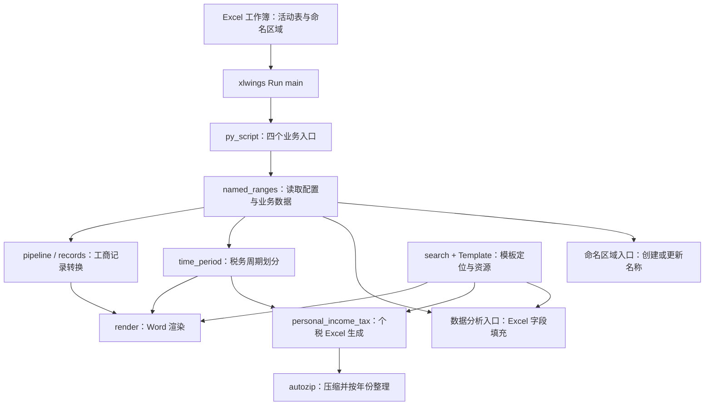

# sheetflow

`sheetflow` 是一套由 Excel 工作表驱动的办公自动化工具：从工作表级命名区域读取数据，选择 Word 或 Excel 模板，生成工商登记、税务申报、个税及报表文档。

项目由一个 Python 包 `sheetflow`、四个 Excel 入口脚本和内置模板组成。Excel 提供数据录入与运行入口；Python 负责数据转换、周期划分、模板渲染、输出目录及归档。

## 架构概览



四条业务流程共享底层能力，但没有统一穿过一个总管道。`pipeline.process_sheet` 专门连接工商 Word 流程；税务和数据分析入口按各自规则组织调用。

| 职责 | 实现 | 如何连接 |
| --- | --- | --- |
| Excel 入口 | `py_script/*.py` | `main()` 取得 `xw.Book.caller()`，选择活动表并组织业务流程 |
| 工作表适配 | `named_ranges.py` | 将 `sheet.names` 转成 Python 字典，也负责批量创建和恢复命名区域 |
| 数据与周期 | `records.py`、`time_period.py` | 分别把列式数据转成行记录、把起止日期转成连续周期；不依赖 Excel 对象 |
| Word 流程 | `pipeline.py`、`render.py` | 校验数据、定位模板、预检文件名，再用 `docxtpl` 渲染和保存 |
| Excel 流程 | `personal_income_tax.py`、`py_script/数据分析.py` | 用 xlwings 打开模板，将字段写入命名区域或单元格，再保存工作簿 |
| 模板定位 | `search.py` | 按完整文件名递归搜索，提供必需模板检查及成功结果缓存 |
| 输出与归档 | `common.py`、`smart_path_manager.py`、`autozip.py` | 创建本次运行目录；个税文件生成后逐个压缩、按年份整理 |
| 错误边界 | `user_errors.py`、`common.run_main` | 统一错误码与 ASCII-safe 文本，在 Run main 出口保留或包装异常 |

`src/sheetflow/__init__.py` 是公开导入接口。命名区域、工商管道及个税生成等依赖 Excel 的对象按需加载。xlwings 承担 Excel 适配；`docxtpl` 承担 Word 渲染；`more-itertools` 提供可迭代对象处理工具。

## 关键目录

```text
sheetflow/
├── src/sheetflow/           # 可安装的 Python 包
│   ├── __init__.py          # 公开接口与按需导入
│   ├── named_ranges.py     # 工作表级命名区域
│   ├── pipeline.py         # 工商工作表到 Word 的流程
│   ├── records.py          # 列式数据转行记录
│   ├── render.py           # Word 文件名预检、渲染与保存
│   ├── search.py           # 模板搜索与缓存
│   ├── time_period.py      # 日期转换与周期划分
│   ├── personal_income_tax.py
│   ├── autozip.py
│   ├── common.py
│   ├── smart_path_manager.py
│   ├── user_errors.py
│   └── Template/
│       ├── Word/           # 16 个 .docx 模板
│       └── Excel/          # 2018.xls、2019.xls、报表分析.xlsx
├── py_script/              # 与 Excel 工作簿名对应的 Run main 入口
│   ├── namedrange.py
│   ├── 工商.py
│   ├── 税务.py
│   └── 数据分析.py
├── tests/                  # 模块行为及入口测试
├── pyproject.toml          # Python 版本、依赖与 Hatchling 构建配置
├── uv.lock                 # 依赖锁文件
├── AGENTS.md               # 仓库协作规范
└── dist/                   # 构建生成的 wheel 和源码包，不纳入版本控制
```

源码目录与业务工作目录可以分开。以下使用目录占位符展示布局：

```text
<项目目录>/                 # 源码、.venv、py_script 和内置模板
<业务工作目录>/             # 输入工作簿，可自行选择位置
├── 工商\工商.xlsx
├── 税务\税务.xlsx
└── 命名区域\namedrange.xlsx
```

这些输入工作簿属于业务工作目录，不是包内的输出模板，也不会因安装 wheel 自动创建。

## 四条业务流程

### 1. 创建命名区域

`namedrange.xlsx → namedrange.main → build_named_range_map → create_sheet_named_ranges → 保存输入工作簿`

配置表提供 `Named`、`Range`、`Sheet_Name`。前两项组成“名称 → 地址”映射，第三项指定目标工作表。名称与地址数量必须一致，名称按不区分大小写检查重复。

覆盖已有名称时，新定义创建失败会尝试恢复原定义。批量创建不是事务：部分成功的更改可能留在 Excel 内存中，但入口只在全部成功后保存；任何失败都会报告错误。

### 2. 工商 Word 文档

`工商.xlsx → 工商.main → process_sheet（读取命名区域 → 数据与模板预检 → RecordSet → render_docx）`

`Template` 选择 Word 模板，其余命名区域作为模板字段。所有字段为标量时生成一份文档；所有字段为等长列表时按行生成多份文档。文件名由 `CN` 字段生成，例如 `公司名称.docx`。

流程先检查工作表、数据形状、模板及本批次文件名，再创建输出目录。列式数据只跳过所有字段都为 `None` 的行；可选字段为空的记录仍会保留。

### 3. 税务 Word 与个税压缩包

`税务.xlsx → 税务.main → generate_period_range → 按 Template 分流`

- **普通模板名**：搜索同名 Word 模板，把公共字段和每个周期的 `start`、`end` 组合成记录，交给 `render_docx`。文件名为 `CN 前六个字符_结束年份年结束月份月.docx`。
- **`个税压缩包`**：调用 `generate_personal_income_tax`。周期起始年份小于 2019 时使用 `2018.xls`，否则使用 `2019.xls`；生成 `YYYY_MM.xls` 后，`auto_zip` 将其压缩为同名 ZIP，移到年份目录，最后删除已成功归档的源文件。

例如跨年两个月的个税输出：

```text
本次输出目录/
├── 2018/2018_12.zip         # 内含 2018_12.xls
└── 2019/2019_01.zip         # 内含 2019_01.xls
```

税务入口会先校验日期与频率。Word 分支还会在创建目录前预检模板及文件名；个税分支在 Excel 生成过程中逐周期定位对应模板。

### 4. Excel 报表填充

`数据分析.xlsx → 数据分析.main → NamedRangeDict → require_template → _write_fields → 保存输出工作簿`

`Template` 选择 `.xlsx` 模板；可选 `Sheet` 指定模板中的目标工作表，默认使用首表。其余字段逐一写入同名区域或对应单元格地址，任一字段写入失败都不会保存正式输出。成功时生成 `DONE_模板名.xlsx`。

如果运行时停留在名为 `named range` 的配置表，入口会切换到第一个非配置表。业务表需要有工作表级 `Template` 名称；仅完成字段命名还不足以选择模板。

## 安装与 Run main 使用

需要 Python 3.10+、uv，以及可由 xlwings 操作的桌面 Excel。已在 Windows 与桌面 Excel 环境中进行真实加载项验证；其他平台与依赖版本组合仍需单独验证。

### 配置源码环境

在仓库根目录执行：

```powershell
uv sync --extra dev
uv run xlwings addin install
```

项目环境位于 `.venv`。Excel 加载项版本应与该环境中的 **xlwings 包版本**一致。

在 Excel 的 xlwings 设置中指定解释器和入口脚本目录。Windows 用户配置文件位于 `%USERPROFILE%\.xlwings\xlwings.conf`，其中 `%USERPROFILE%` 代表当前用户主目录。以下配置中的 `<项目绝对路径>` 是占位符，使用前须替换为项目实际的 Windows 绝对路径：

```text
"SHOW CONSOLE","False"
"INTERPRETER_WIN","<项目绝对路径>\.venv\Scripts\python.exe"
"PYTHONPATH","<项目绝对路径>\py_script"
```

迁移目录后同步调整这两条路径。此处 `PYTHONPATH` 用于定位 Run main 入口，`sheetflow` 包本身由所选 Python 环境提供。更多设置见 [xlwings Add-in & Settings](https://docs.xlwings.org/en/stable/addin.html)。

### 在 Excel 中运行

1. 保存工作簿，确保文件主名与入口脚本相同，例如 `工商.xlsx` 对应 `工商.py`。
2. 激活提供配置或业务数据的工作表，检查工作表级命名区域。
3. 点击 xlwings 功能区的 **Run main**。加载项导入与工作簿同名的 Python 模块，调用其 `main()`。
4. 根据业务流程检查生成文件，或检查命名区域是否创建成功。

| 工作簿主名 | 入口 | 必需配置及数据 |
| --- | --- | --- |
| `namedrange` | `py_script/namedrange.py` | `Named`、`Range`、`Sheet_Name` |
| `工商` | `py_script/工商.py` | `Template`、用于文件名的 `CN`、所选模板的业务字段 |
| `税务` | `py_script/税务.py` | `Template`、`start`、`end`、`freq`，以及所选流程的业务字段；Word 分支使用 `CN` 命名 |
| `数据分析` | `py_script/数据分析.py` | `Template` 和待写入字段；可选 `Sheet` |

避免在工作簿目录和配置的脚本目录同时放置不同版本的同名入口模块，以免导入到意外版本。入口依赖 Excel caller 上下文，直接执行 `python 工商.py` 不等同于点击 Run main。

## 数据、模板与输出约定

### 命名区域与记录

`NamedRangeDict` 只读取当前表的 `sheet.names`，不读取工作簿级全局名称；Excel 日期转换为 `datetime.date`，空单元格读取为 `None`。

工商流程中的 `Template` 是单独的配置值。移除它之后，业务字段必须全部是标量，或全部是等长列表，不能混用。税务流程使用公共字段加周期记录；数据分析流程按字段写入一份 Excel 模板，不经过 `RecordSet`。

### 日期周期

| `freq` | 含义 |
| --- | --- |
| `M` | 按自然月生成周期 |
| `Q` | 按自然季度生成周期 |
| `Y` | 按自然年生成周期 |
| `N` | 整个区间作为一个周期，不切分 |

起止顺序颠倒时会自动交换。`M/Q/Y` 通常扩展到覆盖输入区间的完整自然周期，例如 1 月 15 日至 3 月 20 日按月生成 1、2、3 月三个完整周期。起止为同一天时，所有有效频率都返回该单日区间。

### 模板定位

`Template` 填写不含扩展名和路径分隔符的纯模板名，例如 `企业所得税`。搜索从**当前安装包内**的 `Template/` 目录递归进行，源码布局下对应 `src/sheetflow/Template/`；按完整文件名精确匹配，不把通配符解释为搜索表达式。

调用方根据业务选择 `.docx`、`.xlsx` 或 `.xls`。Word 模板使用 `{{ 字段名 }}` 等 docxtpl 占位符；Excel 模板字段由 xlwings 的 `sheet.range(key)` 定位。

缓存接口最多保存 128 组成功结果；找不到模板的结果不缓存，已缓存路径失效时清除缓存并重搜。因此运行中新增或恢复的模板可被后续调用发现。

### 输出位置与失败后的状态

`SmartPathManager` 创建本次运行的时间戳目录。通常以输入工作簿所在目录为基础；直接子项达到默认阈值 5 时优先使用系统桌面。子项包含文件与目录，但忽略 `~$` 开头的 Excel 临时文件。Windows 使用实际桌面路径；桌面无法解析或不存在时留在工作簿目录。时间戳重名时尝试分钟及序号后缀。

Word 输出名按 Windows 规则检查非法字符、路径分隔符、保留名称及结尾空格或句点；同批次文件名按大小写不敏感检查重复，并验证解析后的路径没有逃出输出目录。

批量处理不承诺整体回滚：

- Word 在预检后逐份渲染、保存；后续渲染失败时，先前成功文档保留。
- 个税 Excel 生成失败时，尽力清理本次新建的部分 `.xls`；已有同名文件不属于该清理集合。
- ZIP 先写临时文件，完成后替换正式目标，最后删除源文件。单文件失败不会回滚其他已完成归档；无法删除源文件时，完整 ZIP 和源文件可能并存。

## 错误信息与已知限制

`user_errors.py` 是错误码与文本格式的统一定义处。Run main 入口返回带 `ERR_*` 前缀的 ASCII-safe 文本，并在 `CN_ESCAPED:` 后附带转义后的中文说明。已有错误码保持原样，其他异常由 `run_main` 包装为 `ERR_RUN_MAIN_FAILED`。

当前已在真实 Excel Run main 链路确认、尚未修复的两项限制：

- **Word 特殊字符可能丢失**：渲染尚未启用 XML 自动转义，字段中的 `&`、`<` 等字符可能导致正文变化。例如文件名可为 `A&B.docx`，正文企业名却变成 `A`。文件生成成功不代表内容完整。
- **模板读取错误可能归类不准**：docxtpl 延迟到渲染阶段才读取模板，读取受限时可能得到 `ERR_RUN_MAIN_FAILED`，而非专用的 `ERR_PERMISSION_DENIED`。

| 错误码 | 含义 |
| --- | --- |
| `ERR_MISSING_NAMED_RANGE` | 缺少必需命名区域 |
| `ERR_NAMED_RANGE_MAP` | Named/Range 长度不一致或名称重复 |
| `ERR_NAMED_RANGE_PARTIAL` | 命名区域批量创建部分失败，入口未保存工作簿 |
| `ERR_NAMED_RANGE_RESTORE_FAILED` | 命名区域覆盖失败且旧定义恢复失败 |
| `ERR_TEMPLATE_NOT_FOUND` | 找不到模板 |
| `ERR_TEMPLATE_NAME` | 模板名为空、包含路径或不是有效的纯模板名 |
| `ERR_TEMPLATE_TYPE` | Word 渲染收到不支持的模板文件类型 |
| `ERR_TEMPLATE_WRITE_FAILED` | Excel 模板字段写入失败 |
| `ERR_FILE_NOT_FOUND` | 指定文件不存在 |
| `ERR_NOT_A_FILE` | 指定路径不是文件 |
| `ERR_SEARCH_PATH` | 模板搜索路径无效 |
| `ERR_INVALID_PATH` | 指定目录路径无效 |
| `ERR_OUTPUT_DIR` | 无法创建输出目录，或归档流程收到无效目录 |
| `ERR_OUTPUT_PATH` | 输出文件名无效、路径逃出输出目录或本批次输出路径重复 |
| `ERR_NO_NAMED_RANGES` | 工商流程的当前工作表没有命名区域 |
| `ERR_MIXED_RECORD_SHAPE` | 工商数据同时混用了列表字段和标量字段 |
| `ERR_RECORD_DATA_TYPE` | 记录集输入不是映射 |
| `ERR_RECORD_KEY_TYPE` | 记录集列名不是字符串 |
| `ERR_RECORD_COLUMN_TYPE` | 记录集列值不是列表 |
| `ERR_RECORD_LENGTH_MISMATCH` | 记录集各列长度不一致 |
| `ERR_PERMISSION_DENIED` | 模板打开阶段捕获到权限异常，见上述延迟读取限制 |
| `ERR_RUN_MAIN_FAILED` | Run main 捕获到未格式化异常 |
| `ERR_ARCHIVE_PARTIAL` | 批量压缩失败或多个源文件对应同一压缩包 |

## 测试与分发

在仓库根目录执行：

```powershell
uv run pytest
uv run python -m compileall py_script src/sheetflow
uv build
```

`tests/` 覆盖记录转换、周期划分、模板搜索、命名区域、文件名预检、归档及入口行为；错误码测试还会校验 README 的错误码表与生产代码一致。涉及 Excel 的自动化测试大量使用替身，不能据此推断真实 COM、加载项或最终文档内容已全部验证。

真实环境检查应使用工作簿副本，经过 Run main 执行，并核对输出内容和失败后的状态。已有真实运行验证覆盖普通工商、非法文件名、跨年个税压缩以及命名区域创建与恢复；上述 Word 内容和错误分类问题仍然存在。

构建使用 Hatchling，生成 wheel 和源码包。wheel 包含 `sheetflow` Python 包及全部 19 个内置模板；顶层 `py_script/` 入口和业务输入工作簿需要另行配置。

安装当前版本 wheel 的示例：

```powershell
uv pip install dist/sheetflow-0.1.0-py3-none-any.whl
```

安装到新的 Python 环境后，需要让 Excel 加载项指向该环境，并提供可导入的入口脚本目录。仓库协作与修改约束见 [AGENTS.md](AGENTS.md)。
